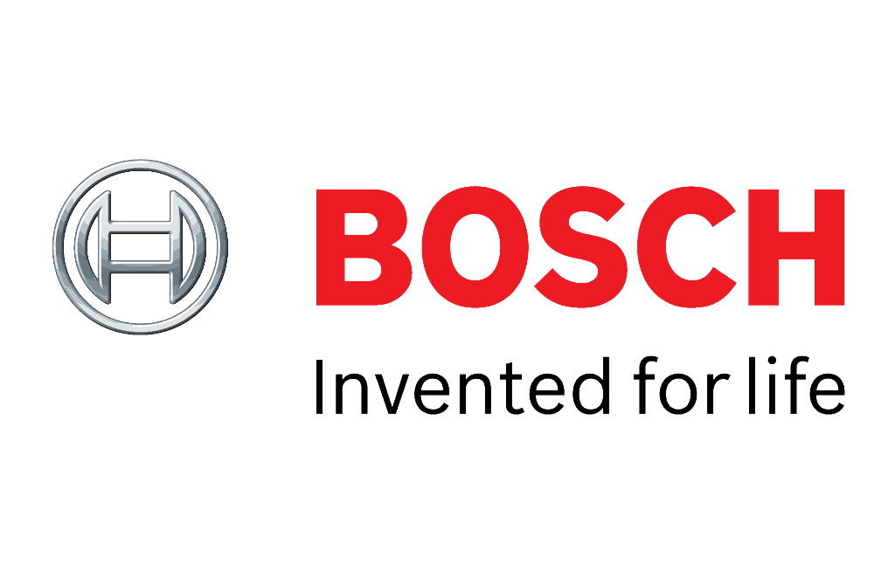
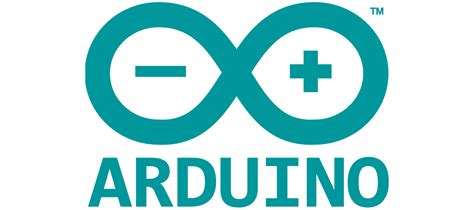
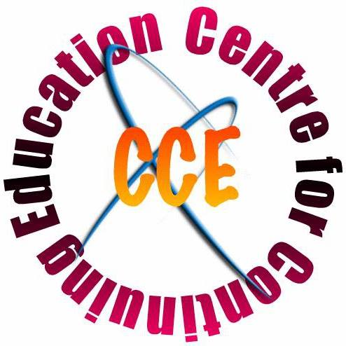

<!-- Main -->

<!-- One -->
<section id="one">
	

<!-- Navigation Menu Buttons -->
<ul class="actions fit">
	<li><a href="#" class="button special fit" id='Education'    onclick="document.getElementById('AboutContentsDiv').innerHTML=document.getElementById('EducationDetailsMD').innerHTML;">Education & Work</a></li>
	<li><a href="#" class="button special fit" id='Publications' onclick="document.getElementById('AboutContentsDiv').innerHTML=document.getElementById('PublicationDetailsMD').innerHTML;">Publications</a></li>
	<li><a href="#" class="button special fit" id='Awards'       onclick="document.getElementById('AboutContentsDiv').innerHTML=document.getElementById('AwardsDetailsMD').innerHTML;">Awards</a></li>
	<li><a href="#" class="button special fit" id='Skills'       onclick="document.getElementById('AboutContentsDiv').innerHTML=document.getElementById('SkillsDetailsMD').innerHTML;">Skills</a></li>
	<li><a href="#" class="button special fit" id='CertificatesAndExams'  onclick="document.getElementById('AboutContentsDiv').innerHTML=document.getElementById('CertificatesAndExamsMD').innerHTML;">Certifications</a></li>
</ul>

<!-- Content for  Button -->

				<table style="width:100%">
					<tr>
						<td style="text-align:center"></td>
						<td style="vertical-align:middle"><b>Master of Science in Neuroengineering (MSNE)</b> 
						October 2019 -  Present <i>Technische Universität München (TUM), Munich</i></td> 
					</tr>
					<tr>
						<td style="text-align:center"></td>
						<td style="vertical-align:middle"><b>Project Assistant</b> 
						August 2018 - September 2019 <i>Indian Institute of Science (IISc), Bengaluru</i></td> 
					</tr>
					<tr>
						<td style="text-align:center"></td>
						<td style="vertical-align:middle"><b>Associate Software Engineer</b> 
						September 2016 - May 2018 <i> Robert Bosch Engineering and Business Solutions (RBEI), Bengaluru</i></td> 
					</tr>
					<tr>
						<td style="text-align:center"></td>
						<td style="vertical-align:middle"><b>Bachelor of Engineering (B.E) in Electrical & Electronics Engineering</b> 
						August 2012 - May 2016 <i>Rashtreeya Vidyalaya College of Engineering (RVCE), Bengaluru</i></td> 
					</tr>
					<tr>
						<td style="text-align:center"></td>
						<td style="vertical-align:middle"><b>Intern</b> 
						January 2016 - April 2016 <i>Robert Bosch Engineering and Business Solutions (RBEI), Bengaluru</i></td> 
					</tr>
					<tr>
						<td style="text-align:center"></td>
						<td style="vertical-align:middle"><b>Avionics Engineer</b> 
						June 2013 - May 2016 <i>Project  Vyoma, Rashtreeya Vidyalaya College of Engineering (RVCE), Bengaluru</i></td> 
				 </tr>
				</table>

    <header class="major">
		<h3>Journals, Magazines and Letters</h3>
		</header>
			<ol>
				<li> Vijaykumar, R., Rudramoorthy, R., and <b> Rao Mangalore, A. (2017).</b> Prediction of solar PV panel temperature using mathematical models and artificial neural networks. Journal of Computational and Theoretical Nanoscience 14, 4986–4997.</li>
			</ol>

       	<ul> 
				<li><b>Placed 3rd in the Graduating Batch of EEE, RVCE</b> 
				Placed 3rd on the basis of 4 year CGPA at the end of the course among the graduating batch of 63 students</li>
				<li><b>Certificate of Merit, Central Board of Secondary Education, India</b> 
				Awarded the certificate of Merit for scoring a perfect CGPA of 10 in the nationwide Class X Board Exams</li>
				<li><b>National Talent Search Examination Scholar - Karnataka State</b> 
				Ranked 22nd in Karnataka state (India) in stage 1 of the national level scholarship program conducted by NCERT at the Secondary school level to identify and recognize students with high intellect and academic talent.</li>
			</ul>

		<table style="width:100%">
					<tr>
						<td style="text-align:center"></td>
						<td style="text-align:center"></td>
						<td style="text-align:center"></td>
					</tr>
					<tr>
						<td style="text-align:center"></td>
						<td style="text-align:center"></td>
						<td style="text-align:center"></td>
					</tr>
					<tr>
						<td style="text-align:center"></td>
						<td style="text-align:center"></td>
						<td style="text-align:center"></td>
					</tr>
					<tr>
						<td style="text-align:center"></td>
						<td style="text-align:center"></td>
						<td style="text-align:center"></td>
					</tr>
				</table>

		

    

		<header class="major">
		<h3>Courses</h3>
		</header>
		<table style="width:100%">
					<tr>
						<td style="text-align:center"></td>
						<td style="vertical-align:middle"><b>Reinforcement Learning</b> 
						<i>CCE, IISc, Bengaluru, India</i></td> 
					</tr>
					<tr>
						<td style="text-align:center"></td>
						<td style="vertical-align:middle"><b>Deep Learning Specialization</b> 
						<i>Coursera</i></td> 
					</tr>
					<tr>
						<td style="text-align:center"></td>
						<td style="vertical-align:middle"><b>Machine Learning Engineer Nanodegree</b> 
						<i>Udacity</i></td> 
					</tr>
					<tr>
						<td style="text-align:center"></td>
						<td style="vertical-align:middle"><b>Build a Modern Computer from First Principles:From Nand to Tetris </b> 
						<i>Hebrew University of Jerusalem, Coursera</i></td> 
					</tr>
					<tr>
						<td style="text-align:center"></td>
						<td style="vertical-align:middle"><b>edX Honor Code Certificate for Circuits and Electronics </b> 
						<i>Edx:MITx</i></td> 
					</tr>
					<tr>
						<td style="text-align:center"></td>
						<td style="vertical-align:middle"><b>edX Honor Code Certificate for Electricity and Magnetism </b> 
						<i>Edx:MITx</i></td> 
					</tr>
				</table>
	

	

		<header class="major">
		<h3>Exams</h3>
		</header>
				<table style="width:100%">
					<tr>
						<td style="text-align:center"></td>
						<td style="vertical-align:middle"><b>112/120</b> 
						<i>ETS TOEFL</i></td> 
					</tr>
					<tr>
						<td style="text-align:center"></td>
						<td style="vertical-align:middle"><b>326/340, 4.5/6 </b> 
						<i>ETS GRE</i></td> 
					</tr>
					<tr>
						<td style="text-align:center"></td>
						<td style="vertical-align:middle"><b>A2 Certification in the German Language</b> 
						<i>Goethe Insitut</i></td> 
					</tr>
				</table>
	

	

<!-- Display Div-->

<a href="assets/files/CV_Ashish_Rao_Mangalore.pdf" class="button icon fa-download" target="_blank">Download CV</a>

<header class="major">
<h1>Languages</h1>
</header>
	<table style="width:100%">
		<tr>
			<td style="text-align:center"><h2>Fluent</h2></td>
			<td style="text-align:center;vertical-align:middle"><h1><b>English</b></h1> </td>
			<td style="text-align:center;vertical-align:middle"></td>
			<td style="text-align:center;vertical-align:middle"></td>  
		</tr>
		<tr>
			<td style="text-align:center"><h2>Intermediate</h2></td>
			<td style="text-align:center;vertical-align:middle"></td> 
		</tr>
		<tr>
			<td style="text-align:center"><h2>Basic</h2></td>
			<td style="text-align:center;vertical-align:middle"><h1><b>Deutsch</b></h1> </td> 
			<td style="text-align:center;vertical-align:middle"></td>
			<td style="text-align:center;vertical-align:middle"> 
			(Reading and Writing)</td>
		</tr>
		</table>

</section>

