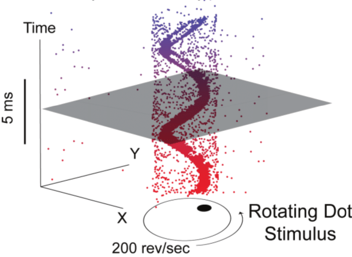
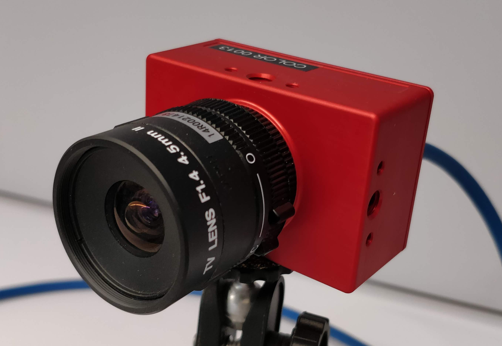
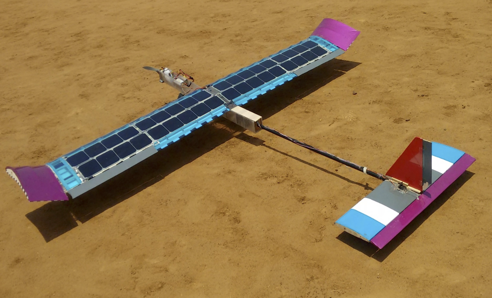
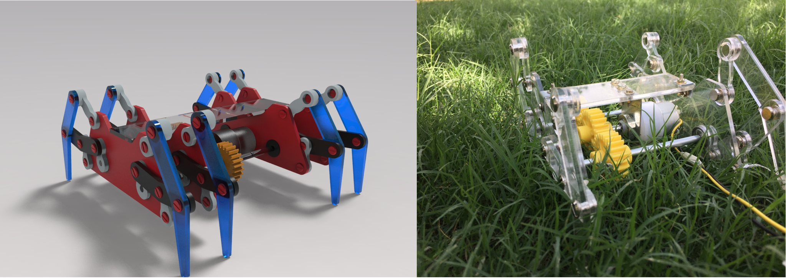
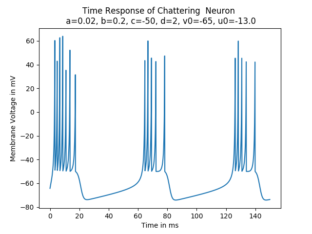

<!-- Main -->

<!-- One -->
<section id="one">

<ul class="actions fit">
	<li><a href="#" class="button  fit" id='Education'    onclick="document.getElementById('ProjectContentsDiv').innerHTML=document.getElementById('EventBasedVisionMD').innerHTML;">Event Based Vision</a></li>
	<li><a href="#" class="button  fit" id='Drones' onclick="document.getElementById('ProjectContentsDiv').innerHTML=document.getElementById('DronesMD').innerHTML;">UAVs and Drones</a></li>
	<li><a href="#" class="button  fit" id='MachineLearning'       onclick="document.getElementById('ProjectContentsDiv').innerHTML=document.getElementById('MachineLearningMD').innerHTML;">Neuroscience and ML</a></li>
</ul>

		
Forget Computer Vision as you know it and get ready to  meet Event Cameras. Currently, a lot of new paradigms for visual sensing are being explored  and event cameras happen to be one of them. Numerous application have been gaining traction over the years. You can read more about the cutting edge <a href="https://github.com/uzh-rpg/event-based_vision_resources">here</a>. During my time at the Indian Insitute of Science as a project assistant, I'd worked on some interesting problems in Event based vision. Below is the work I have done during that period.

		<header class="major">
		<h3>Phase of Events</h3>
		</header>
				

				Fringe Pattern Profilometry has been a popular problem in traditional computer vision. Can it be solved using data from only an event sensor. This project aims to explore this question.

		 		You can follow the project <a href="https://github.com/ashishrao7/POE3D" target="_blank">here</a>
		<header class="major">
		<h3 >Neuromorphic Sampling</h3>
		</header>
				
 Data from a neuromorphic vision sensor is sparse and non uniformly sampled. Under what conditions would perfect reconstruction be possible. This project aims to simulate a few toy experiments to answer that question. A bare bones event simulator is also available here.

				You can follow the project <a href="https://github.com/ashishrao7/Neuromorphic-Sampling" target="_blank">here</a>  
		<header class="major">
		<h3>MC3D: Motion Contrast 3D</h3>
		</header>
			
 Line Scanning methods have been around since years to perform 3-D reconstructions of objects. Would doing this with an event camera make the process any better? This research was done by the computational photography group at the Northwestern University. The <a href="https://compphotolab.northwestern.edu/wordpress/wp-content/uploads/2015/04/dvs_031.pdf" target="_blank">paper</a> has been implemented in the repository for this project.

			You can follow the project <a href="https://github.com/ashishrao7/motion_contrast_3D" target="_blank">here</a>
		<header class="major">
		<h3>EMVS: Event Based Multi View Stereo</h3>
		</header>
			
 Backprojection based methods have been around for 3-D reconstruction. Turns out event cameras work very well for this problem giving semi-dense 3-D reconstructions. An attempt to implement the EMVS paper was made here. The <a href="https://link.springer.com/article/10.1007/s11263-017-1050-6" target="_blank">paper</a> has been implemented in the repository for this project.

			You can follow the project <a href="https://github.com/ashishrao7/Event-Based-Vision" target="_blank">here</a>	

		
 During my time in the aerodesign club of RVCE, Bengaluru, me along with my team worked on various projects related to drones, unmanned arial vehicles and systems. Listed below is a collection of a few of these works
 
		<header class="major">
		<h3>Solar Plane</h3>
		</header>
				
 Data from a neuromorphic vision sensor is sparse and non uniformly sampled. Under what conditions would perfect reconstruction be possible. This project aims to simulate a few toy experiments to answer that question. A bare bones event simulator is also available here.

				You can follow the project <a href="https://github.com/ashishrao7/Neuromorphic-Sampling" target="_blank">here</a>  
		<header class="major">
		<h3>Quadrotors and Fixed Wing Vehicles: Lots of Em!</h3>
		</header>
				
 Data from a neuromorphic vision sensor is sparse and non uniformly sampled. Under what conditions would perfect reconstruction be possible. This project aims to simulate a few toy experiments to answer that question. A bare bones event simulator is also available here.

				You can follow the project <a href="https://github.com/ashishrao7/Neuromorphic-Sampling" target="_blank">here</a>  
		<header class="major">
		<h3>Thrust Rig</h3>
		</header>
			
 Line Scanning methods have been around since years to perform 3-D reconstructions of objects. Would doing this with an event camera make the process any better? This research was done by the computational photography group at the Northwestern University. The <a href="https://compphotolab.northwestern.edu/wordpress/wp-content/uploads/2015/04/dvs_031.pdf" target="_blank">paper</a> has been implemented in the repository for this project.

			You can follow the project <a href="https://github.com/ashishrao7/motion_contrast_3D" target="_blank">here</a>
		<header class="major">
		<h3>DBF: Design/Build/Fly 2015</h3>
		</header>
			
 Line Scanning methods have been around since years to perform 3-D reconstructions of objects. Would doing this with an event camera make the process any better? This research was done by the computational photography group at the Northwestern University. The <a href="https://compphotolab.northwestern.edu/wordpress/wp-content/uploads/2015/04/dvs_031.pdf" target="_blank">paper</a> has been implemented in the repository for this project.

			You can follow the project <a href="https://github.com/ashishrao7/motion_contrast_3D" target="_blank">here</a>
		<header class="major">
				<h3>Sparkfun AVC 2015</h3>
		</header>
			
 Backprojection based methods have been around for 3-D reconstruction. Turns out event cameras work very well for this problem giving semi-dense 3-D reconstructions. An attempt to implement the EMVS paper was made here. The <a href="https://link.springer.com/article/10.1007/s11263-017-1050-6" target="_blank">paper</a> has been implemented in the repository for this project.

			You can follow the project <a href="https://github.com/ashishrao7/Event-Based-Vision" target="_blank">here</a>	
		<header class="major">
		<h3>Robotic Crab using Klann Mechanism Design</h3>
		</header>
			
 Backprojection based methods have been around for 3-D reconstruction. Turns out event cameras work very well for this problem giving semi-dense 3-D reconstructions. An attempt to implement the EMVS paper was made here. The <a href="https://link.springer.com/article/10.1007/s11263-017-1050-6" target="_blank">paper</a> has been implemented in the repository for this project.

			You can follow the project <a href="https://github.com/ashishrao7/Event-Based-Vision" target="_blank">here</a>	

    <b>ARTICLE 3</b> This is information about Awards
		Solar Plane
		robotic crab
		DBF
		Quadrotors
		Thrust Rig

		<header class="major">
		<h3>Spiking Neurons: LIF and Izhikevich</h3>
		</header>
			
 Spiking Neural Networks - and what's the smallest unit of one, a Spiking Neuron. Implementation of the Leaky Integrate and Fire Neuron and the Izhikevich Neuron are available in this repo.  
			You can follow the project <a href="https://gitlab.com/rao_art/SNN" target="_blank">here</a>

    <b>ARTICLE 4</b> Solar panel temperature prediction, spiking neuron, corner detection, stock pricing?

<!-- Display Div-->

</section>

